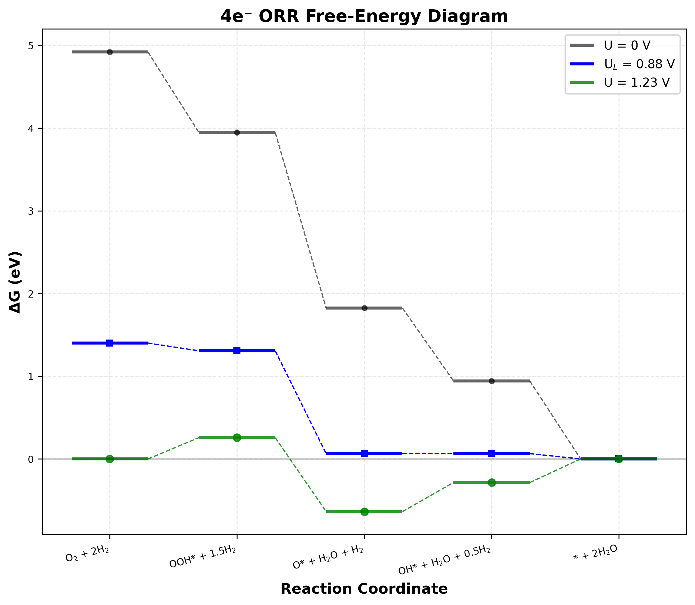

# ORR Overpotential Calculator

* A Python package for calculating overpotentials of the Oxygen Reduction Reaction (ORR).

## Table of Contents

- [Installation](#installation)
- [Quick Start](#quick-start)
- [Usage Examples](#usage-examples)
- [Parameters](#parameters)
- [Dependencies](#dependencies)
- [References](#references)

## Installation

### From GitHub Repository

```bash
pip install git+https://github.com/ishikawa-group/orr_overpotential_calculator.git
```

### From Pre-built Wheel

```bash
pip install orr_overpotential_calculator-0.1.0-py3-none-any.whl
```

## Quick Start

### Cluster

* See `README.md` in `example/cluster/`.

### General

* Here's a minimal example to get you started:

```python
from ase.build import fcc111
from orr_overpotential_calculator import calc_orr_overpotential

# Create a Pt(111) surface
bulk = fcc111("Pt", size=(3, 3, 4), a=3.9, vacuum=None, periodic=True)

# Calculate ORR overpotential
result = calc_orr_overpotential(bulk=bulk)
eta = result["eta"]

print(f"ORR overpotential: {eta:.3f} V")
```

## Output

* The package generates several output files in the specified `outdir`:

- `ORR_summary.txt`: Summary of energies and overpotential
- `ORR_free_energy_diagram.png`: Free energy diagram plot
- `all_results.json`: Complete calculation results in JSON format
- Individual calculation directories for each step

### Example Output: Free Energy Diagram

* The calculated free energy diagram shows the reaction pathway for the oxygen reduction reaction:



*Figure: Example of the automatically generated free energy diagram showing the 4-electron ORR pathway on a catalyst surface.*

## Usage Examples

### Basic Usage with MACE Calculator

```python
#!/usr/bin/env python3
from pathlib import Path
from typing import Dict, Any, List, Tuple

from ase.build import fcc111
from orr_overpotential_calculator import calc_orr_overpotential

# Configuration parameters
outdir = str(Path(__file__).parent / "Pt111")
overwrite = True  # Overwrite existing calculations
log_level = "INFO"
calculator = "mace"
vasp_yaml_path = str(Path(__file__).parent / "vasp.yaml")
solvent_correction_yaml_path = str(Path(__file__).parent / "solvent_correction.yaml")  # Optional

# Create bulk structure
bulk = fcc111("Pt", size=(3, 3, 4), a=3.9, vacuum=None, periodic=True)

# Define adsorption sites for ORR intermediates
orr_adsorbates: Dict[str, List[Tuple[float, float]]] = {
    "HO2": [(0.0, 0.0), (0.5, 0.0), (0.33, 0.33), (0.66, 0.66)],  # ontop, bridge, fcc, hcp
    "O":   [(0.0, 0.0), (0.5, 0.0), (0.33, 0.33), (0.66, 0.66)],
    "OH":  [(0.0, 0.0), (0.5, 0.0), (0.33, 0.33), (0.66, 0.66)],
}

# Calculate ORR overpotential
result = calc_orr_overpotential(
    bulk=bulk,
    outdir=outdir,
    overwrite=overwrite,
    log_level=log_level,
    calculator=calculator,
    adsorbates=orr_adsorbates,
    vasp_yaml_path=vasp_yaml_path,
    solvent_correction_yaml_path=solvent_correction_yaml_path
)

# Extract results
eta = result["eta"]
limiting_potential = result["U_L"]

# Display results
print(f"ORR overpotential: {eta:.3f} V")
print(f"Limiting potential: {limiting_potential:.3f} V")
```
* "vasp" can also be used as `calculator`.
* `solvent_correction_yaml_path` applies solvation corrections to adsorbate energies (default: O: 0, OOH: 0.25, OH: 0.5 eV).

### Custom Adsorption Sites

```python
from ase.build import fcc111
from orr_overpotential_calculator import calc_orr_overpotential

bulk = fcc111("Pt", size=(3, 3, 4), a=3.9, vacuum=None, periodic=True)

# Define custom adsorption sites (fractional coordinates)
custom_sites = {
    "HO2": [(0.0, 0.0), (0.5, 0.5)],  # Only ontop and bridge
    "O":   [(0.33, 0.33)],             # Only fcc hollow
    "OH":  [(0.0, 0.0), (0.33, 0.33), (0.66, 0.66)],  # ontop, fcc, hcp
}

result = calc_orr_overpotential(
    bulk=bulk,
    adsorbates=custom_sites,
    outdir="custom_sites"
)

eta = result["eta"]
print(f"ORR overpotential (custom sites): {eta:.3f} V")
```

## Parameters

### Main Function Parameters

| Parameter | Type | Default | Description |
|-----------|------|---------|-------------|
| `bulk` | `Atoms` | Required | ASE Atoms object representing the bulk structure |
| `outdir` | `str` | `"result"` | Directory for saving calculation results |
| `overwrite` | `bool` | `False` | Whether to overwrite existing calculations |
| `log_level` | `str` | `"INFO"` | Logging level ("DEBUG", "INFO", "WARNING", "ERROR") |
| `calculator` | `str` | `"mace"` | Calculator type ("vasp", "mace", "mace-d3") |
| `adsorbates` | `Dict` | `None` | Custom adsorption site definitions (optional) |
| `vasp_yaml_path` | `str` | `None` | Path to VASP configuration file (required for VASP) |
| `solvent_correction_yaml_path` | `str` | `None` | Path to solvent correction YAML file (optional) |

## Output Files

* The package generates several output files in the specified `outdir`:

- `ORR_summary.txt`: Summary of energies and overpotential
- `ORR_free_energy_diagram.png`: Free energy diagram plot
- `all_results.json`: Complete calculation results in JSON format
- Individual calculation directories for each step

## References

1. **Nørskov, J. K., Rossmeisl, J., Logadottir, A., & Lindqvist, L.** (2004). Origin of the Overpotential for Oxygen Reduction at a Fuel-Cell Cathode. *The Journal of Physical Chemistry B*, 108(46), 17886-17892. [https://doi.org/10.1021/jp047349j](https://doi.org/10.1021/jp047349j)

2. **Zhang, Q., & Asthagiri, A.** (2019). Solvation effects on DFT predictions of ORR activity on metal surfaces. *Catalysis Today*, 323, 35-43. [https://doi.org/10.1016/j.cattod.2018.07.036](https://doi.org/10.1016/j.cattod.2018.07.036)

3. **Nair, A. S., & Pathak, B.** (2019). Importance of Dispersion and Relativistic Effects for ORR Overpotential Calculation on Pt(111) surface. *arXiv:1908.08697*. [https://doi.org/10.48550/arXiv.1908.08697](https://doi.org/10.48550/arXiv.1908.08697)

4. **Bajdich, M., García-Mota, M., Vojvodic, A., Nørskov, J. K., & Bell, A. T.** (2013). Theoretical Investigation of the Activity of Cobalt Oxides for the Electrochemical Oxidation of Water. *Journal of the American Chemical Society*, 135(36), 13521-13530. [https://doi.org/10.1021/ja405997s](https://doi.org/10.1021/ja405997s)

5. **Daniel Martín Yerga.** (2019). Practical introduction to DFT for Electrocatalysis – 1. Free energy diagrams. [https://dyerga.org/blog/2019/02/09/practical-introduction-to-dft-for-electrocatalysis-1-free-energy-diagrams/](https://dyerga.org/blog/2019/02/09/practical-introduction-to-dft-for-electrocatalysis-1-free-energy-diagrams/)

## License

* MIT lincense
