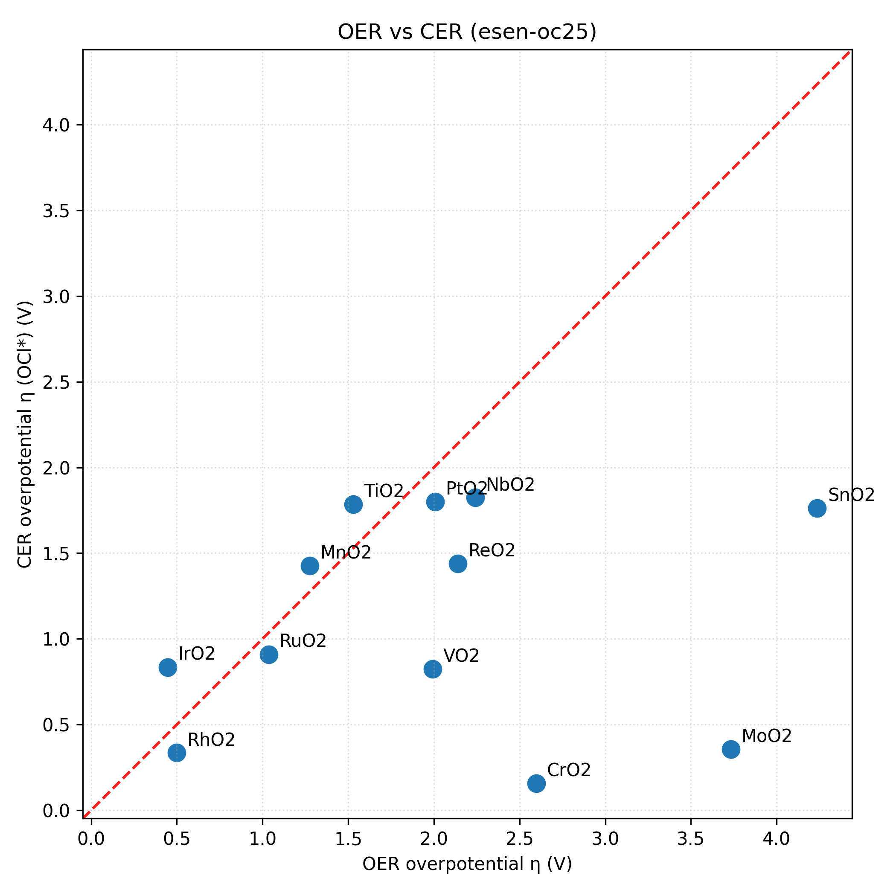

# CER example (rutile MO2)

This directory provides a minimal workflow to compare OER and CER overpotentials on rutile-type `MO2(110)` surfaces using this repository’s calculators.

## What this example does

For each rutile `MO2` bulk structure (`*_opt_bulk.xyz`) it builds two slabs:

- **OER slab (high coverage, vacancy)**: remove only one terminal top-layer O (keeps O coverage high)
- **CER slab (full coverage)**: keep all terminal O, then adsorb **Cl only** and interpret the intermediate as **OCl\*** via the O-covered surface

Then it computes:

- OER overpotential `η_OER` on the **vacancy** slab (via `surface.oer_overpotential_calculator.calc_oer_overpotential`)
- CER overpotential `η_CER(OCl*)` on the **full-coverage** slab (via `surface.cer_overpotential_calculator.calc_cer_overpotential(intermediate="OCl*")`)

## How to run

The main script is:

- `example/cer/code/oxide_oer_cer_.py`

Run all materials found in the rutile bulk directory:

```bash
python example/cer/code/oxide_oer_cer_.py --calculator esen-oc25
```

Run selected materials:

```bash
python example/cer/code/oxide_oer_cer_.py --calculator esen-oc25 --materials RuO2 MnO2
```

Notes:

- `esen-oc25` uses FAIRChem’s OC25 model; the first run downloads weights from Hugging Face.
- You can change the bulk data location with `--data-dir`.

## Outputs

Top-level summary artifacts are written to:

- `example/cer/result/oer_cer_summary.csv`
- `example/cer/result/oer_vs_cer.png`

Per-material calculation outputs are written under:

- `example/cer/result/<calculator>/<material>/`

### CSV columns (summary)

- `eta_OER`, `U_L_OER`: OER overpotential and limiting potential
- `eta_CER_OCl*`, `U_L_CER_OCl*`: CER(OCl*) overpotential and limiting potential

## How to read the plot

`example/cer/result/oer_vs_cer.png` is a scatter plot:

- x-axis: `η_OER` (V)
- y-axis: `η_CER(OCl*)` (V)

Lower-left is generally “better” (low overpotential for both reactions).


