# ORR Overpotential Calculation for Nanoparticle Catalysts

This directory contains sample code for calculating the overpotential of Oxygen Reduction Reaction (ORR) on nanoparticle catalysts.

## Overview

The Oxygen Reduction Reaction (ORR) consists of a four-step electron transfer process:

1. `O₂(g) + * + ½H₂ → OOH*`
2. `OOH* + ½H₂ → O* + H₂O`
3. `O* + ½H₂ → OH*`
4. `OH* + ½H₂ → * + H₂O`

This workflow calculates the ORR overpotential on Pt nanoparticles to evaluate catalytic activity.

## 1. Visualization of Adsorption Structures

First, we visualize adsorption structures to understand adsorption sites on nanoparticles:

```python
import numpy as np
from ase import Atoms
from ase.io import write
from ase.cluster.octahedron import Octahedron
from orr_overpotential_calculator import place_adsorbate
import os

# Create an octahedral Pt cluster with edge length of 4 atoms
cluster = Octahedron('Pt', length=4)  
print(f"Number of atoms in cluster: {len(cluster)}")

# Define OH adsorbate molecule (O atom at origin, H atom at 0.97Å in z-direction)
adsorbate = Atoms("OH", positions=[(0, 0, 0), (0, 0, 0.97)])

# Output directory
output_dir = "result"
os.makedirs(output_dir, exist_ok=True)

# List of site atom indices for placement
site_indices = [
    (0,),           # edge_top
    (0, 1),         # edge_bridge
    (12,),          # face_top
    (1, 12),        # face_bridge
    (1, 2, 12)      # face_3fold_hollow
]

# Create and save structures for each site_index
for site_index in site_indices:
    # Place OH molecule at height 2.0Å
    combined_structure = place_adsorbate(cluster, adsorbate, site_index, height=2.0)
    print(f"Site index {site_index}: Total atoms after placement: {len(combined_structure)}")
    
    # Create filename
    site_str = "_".join(map(str, site_index))
    filename = f"cluster_adsorbate_index_{site_str}.png"
    filepath = os.path.join(output_dir, filename)
    
    # Save image
    write(filepath, combined_structure, rotation='-90z, 100y, 15x')
    print(f"Saved: {filepath}")
```

### Generated Adsorption Structures

After execution, the following images will be generated in the `result/` directory:

Adsorption structures for each site type:
| Site Type | Filename | Structure |
|-------------|-----------|------|
| Edge-top site | `cluster_adsorbate_index_0.png` | 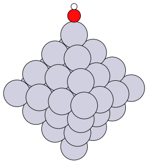 |
| Edge-bridge site | `cluster_adsorbate_index_0_1.png` | 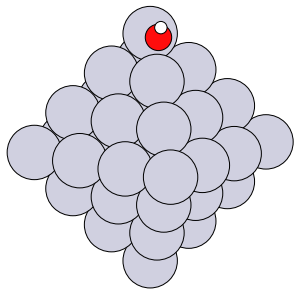 |
| Face-top site | `cluster_adsorbate_index_12.png` | 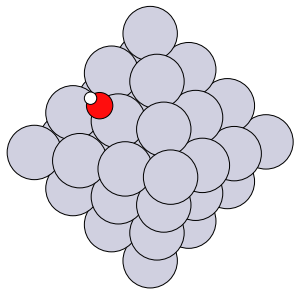 |
| Face-bridge site | `cluster_adsorbate_index_1_12.png` | 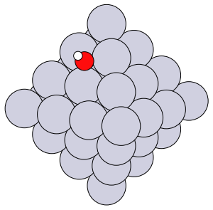 |
| Face 3-fold hollow site | `cluster_adsorbate_index_1_2_12.png` | 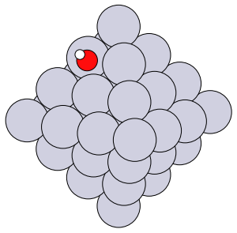 |

## 2. ORR Overpotential Calculation

### run_nanoparticle_orr.py

```python
#!/usr/bin/env python3
import argparse
import sys
from pathlib import Path
from typing import Dict, Any, List, Tuple

# Import ASE modules
from ase.build import fcc111
from ase.cluster.octahedron import Octahedron

# Import ORR overpotential calculation function
from orr_overpotential_calculator import calc_nanoparticle_orr_overpotential

#---------------------
# Parameter settings
#---------------------
base_dir = str(Path(__file__).parent / "Pt_nanoparticle_mattersim")
force = True                    # Overwrite existing calculations
log_level = "INFO"              # Logging level
calc_type = "mattersim"         # Calculation engine
yaml_path = str(Path(__file__).parent / "vasp.yaml")  # Configuration file

# Create Pt nanoparticle cluster (octahedron, edge length 4 atoms)
cluster = Octahedron('Pt', length=4, cutoff=0) 

# Define adsorption sites (atom indices for each adsorbate species)
orr_adsorbates: Dict[str, List[Tuple]] = {
    "HO2": [(0,), (0, 1), (12,), (1, 12), (1, 2, 12)],  # OOH adsorbate
    "O":   [(0,), (0, 1), (12,), (1, 12), (1, 2, 12)],  # O adsorbate
    "OH":  [(0,), (0, 1), (12,), (1, 12), (1, 2, 12)],  # OH adsorbate
}

# Function call: receive results as dictionary
result = calc_nanoparticle_orr_overpotential(
    nanoparticle=cluster,
    base_dir=base_dir,
    force=force,
    log_level=log_level,
    calc_type=calc_type,
    adsorbates=orr_adsorbates,
    yaml_path=yaml_path
)

# Extract required values from the dictionary
eta = result["eta"]
diffG_U0 = result["diffG_U0"]
diffG_eq = result["diffG_eq"]

print(f"ORR overpotential: {eta:.3f} V")
print(f"Reaction Free Energy Change at U=0V: {diffG_U0}")
print(f"Reaction Free Energy Change at U=1.23V: {diffG_eq}")
```

### Example of Generated Free Energy Diagram

After completing the calculation, a free energy diagram like the following will be generated:


## 3. Calculation Workflow

### 3.1 Nanoparticle Optimization
- Structural optimization of octahedral Pt cluster

### 3.2 Gas-phase Molecule Optimization
Optimization of gas-phase structures for:
- H₂, O₂, H₂O (gas-phase only)
- OH, OOH, O (gas-phase + adsorption calculations)

### 3.3 Adsorption Calculations
For each adsorbate (OH, OOH, O), adsorption calculations at five specified sites:
- `(0,)`: Edge-top site
- `(0, 1)`: Edge-bridge site
- `(12,)`: Face-top site
- `(1, 12)`: Face-bridge site
- `(1, 2, 12)`: Face 3-fold hollow site

### 3.4 Reaction Energy Calculation
- Select the most stable site for each adsorbate
- Calculate energies for the four reaction steps (ΔE₁, ΔE₂, ΔE₃, ΔE₄)
- Apply energy corrections:
  - O₂ energy correction (DFT error compensation)
  - Solvent effect corrections (OOH*: -0.1 eV, OH*: -0.2 eV)

### 3.5 Overpotential Calculation
- Zero-point energy (ZPE) correction
- Entropy (T×S) correction
- Calculate free energy changes (ΔG)
- Determine limiting potential (U_L) and overpotential (η = 1.23 - U_L)

## 4. Output Results

### 4.1 Main Output Files
- `all_results.json`: Integrated data from all calculations
- `ORR_summary.txt`: Summary of overpotential calculation
- `ORR_free_energy_diagram.png`: Free energy diagram

### 4.2 Interpreting Results
- **Overpotential (η)**: Lower values indicate higher activity (ideally 0 V)
- **Rate-limiting step**: Step with the highest energy barrier in the free energy diagram
- **Limiting potential (U_L)**: Potential at which all reaction steps become thermodynamically downhill

## 5. Parameter Adjustments

### 5.1 Changing Adsorption Sites
You can modify site indices in the `orr_adsorbates` dictionary:

```python
orr_adsorbates = {
    "HO2": [(0,), (5,), (10,)],  # Only specific sites
    "O":   [(0,), (1,), (2,)],
    "OH":  [(0,), (1,), (2,)],
}
```

### 5.2 Changing Cluster Size
```python
cluster = Octahedron('Pt', length=3)  # Smaller cluster
cluster = Octahedron('Pt', length=5)  # Larger cluster
```

## 6. Important Notes
- The `place_adsorbate` function places the adsorbate molecule at the specified site. Therefore, please verify the site selection in advance according to the structure you've created.
- Different cluster sizes may require different site indices due to atom numbering changes.


## 7. Advanced Options

### 7.1 Custom Height and Orientation
You can adjust adsorbate placement height and orientation:

```python
# Place adsorbate at custom height and orientation
combined_structure = place_adsorbate(
    cluster, 
    adsorbate, 
    indices=(0,), 
    height=1.8,  # Å
    orientation=[1, 0, 0]  # Orient along x-axis
)
```

### 7.2 Using Different Calculators
You can switch between different calculation methods:

```python
# Use VASP calculator
result = calc_nanoparticle_orr_overpotential(
    nanoparticle=cluster,
    calc_type="vasp",
    yaml_path="path/to/vasp.yaml"
)

# Use machine learning potential
result = calc_nanoparticle_orr_overpotential(
    nanoparticle=cluster,
    calc_type="mattersim"
)
```

## 8. Investigation of Pt Nanoparticle Size Dependence

This section demonstrates how to investigate the effect of Pt nanoparticle size on ORR activity.

### 8.1 Single Size Calculation Example (Length 2)

Here is an example of performing calculations for a Pt nanoparticle of size 2 (length=2):

```python
#!/usr/bin/env python3
import sys
from pathlib import Path
from typing import Dict, Any, List, Tuple

# Import ASE modules
from ase.build import fcc111
from ase.cluster.octahedron import Octahedron

# Import ORR overpotential calculation function
from orr_overpotential_calculator import calc_nanoparticle_orr_overpotential

#---------------------
# Parameter settings
base_dir = str(Path(__file__).parent.parent / "Pt_nanoparticle_vasp/length_2")
force = True
log_level = "INFO"
calc_type = "vasp"
yaml_path = str(Path(__file__).parent / "vasp.yaml")
#----------------

cluster = Octahedron('Pt', length=2, cutoff=0) 

# Define tuples correctly
orr_adsorbates: Dict[str, List[Tuple]] = {
    "HO2": [(0,)], 
    "O":   [(0,)],
    "OH":  [(0,)],
}

# For multiple sites, specify as follows:
# orr_adsorbates: Dict[str, List[Tuple]] = {
#     "HO2": [(0,), (0, 1), (12,), (1, 12), (1, 2, 12)],
#     "O":   [(0,), (0, 1), (12,), (1, 12), (1, 2, 12)],
#     "OH":  [(0,), (0, 1), (12,), (1, 12), (1, 2, 12)],
# }

# Function call: receive results as dictionary
result = calc_nanoparticle_orr_overpotential(
    nanoparticle=cluster,
    base_dir=base_dir,
    force=force,
    log_level=log_level,
    calc_type=calc_type,
    adsorbates=orr_adsorbates,
    yaml_path=yaml_path
)

# Extract required values from the dictionary
eta = result["eta"]
diffG_U0 = result["diffG_U0"]
diffG_eq = result["diffG_eq"]

print(f"ORR overpotential: {eta:.3f} V")
print(f"Reaction Free Energy Change at U=0V: {diffG_U0}")
print(f"Reaction Free Energy Change at U=1.23V: {diffG_eq}")
```

### 8.2 Size Dependence Analysis

To compare calculation results for multiple sizes (length=2~5) of nanoparticles, use the following script:

```python
#!/usr/bin/env python
# -*- coding: utf-8 -*-

"""
Energy diagram plotting script for Pt nanoparticle ORR calculations
Generate individual energy diagrams for each material
"""

import os
import sys
from pathlib import Path
from typing import Dict

# Import tool modules from ORR calculator
from orr_overpotential_calculator import generate_result_csv, plot_free_energy_diagram

# Base path settings
base_dir = Path(__file__).parent.parent
data_dir = base_dir / "Pt_nanoparticle_vasp"
result_dir = base_dir / "result"

# Create result directory if it doesn't exist
result_dir.mkdir(exist_ok=True)

# Output file paths
csv_path = result_dir / "orr_results_nanoparticles.csv"

# Collect material data paths
materials_data = {}
for length in range(2, 6):  # From length_2 to length_5
    material_name = f"Pt_nano_length_{length}"
    json_path = data_dir / f"length_{length}" / "all_results.json"
    
    if json_path.exists():
        materials_data[material_name] = str(json_path)
        print(f"Found data for {material_name}: {json_path}")
    else:
        print(f"Warning: Result file not found: {json_path}")

if not materials_data:
    print("Error: No data files found!")
    sys.exit(1)

print(f"Number of materials to process: {len(materials_data)}")

# Generate CSV from results
csv_file = generate_result_csv(
    materials_data=materials_data,
    output_csv=str(csv_path),
    verbose=True
)

if not csv_file:
    print("Error occurred during CSV file generation.")
    sys.exit(1)

print(f"Generated CSV file: {csv_file}")

# 1. First create comparison plot with all materials
comparison_plot_path = result_dir / "free_energy_diagram_comparison.png"
diagram_path = plot_free_energy_diagram(
    csv_file=csv_file,
    output_file=str(comparison_plot_path),
    equilibrium_potential=1.23,
    dpi=300,
    figsize=(12, 9),
    show_u0=True,
    show_ueq=True,
)
print(f"Generated comparison energy diagram: {diagram_path}")

# 2. Create individual plots for each material
for material_name in materials_data.keys():
    # Include material name in output filename
    individual_plot_path = result_dir / f"free_energy_diagram_{material_name}.png"
    
    # Generate individual energy diagram for each material
    individual_diagram_path = plot_free_energy_diagram(
        csv_file=csv_file,
        output_file=str(individual_plot_path),
        equilibrium_potential=1.23,
        dpi=300,
        figsize=(10, 8),
        show_u0=True,
        show_ueq=True,
        material_name=material_name,  # Specify individual material name
    )
    
    print(f"Generated energy diagram for {material_name}: {individual_diagram_path}")

print("All processing completed successfully.")
```

### 8.3 Result Analysis

After calculations, the following files will be generated:

1. `orr_results_nanoparticles.csv` - CSV file summarizing ORR calculation results for each size nanoparticle
2. `free_energy_diagram_nanoparticles.png` - Graph comparing free energy changes for each size nanoparticle

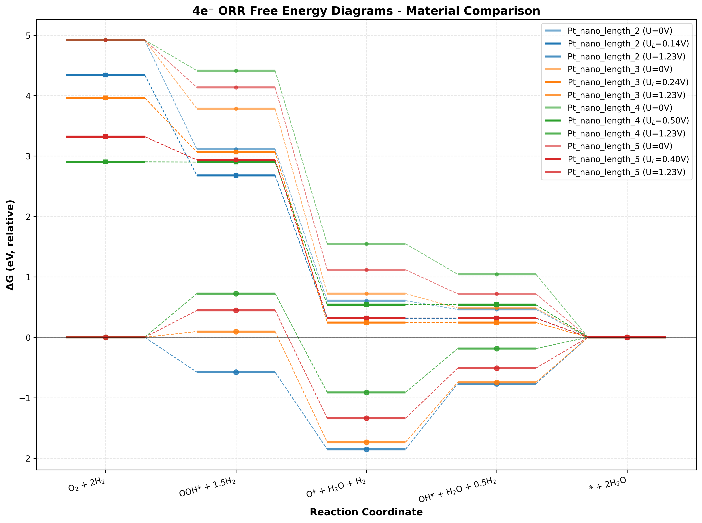

### Individual Results by Nanoparticle Size

| Length | Structure example | Free Energy Diagram |
|--------|-----------|-------------------|
| 2 | 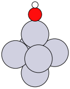 | 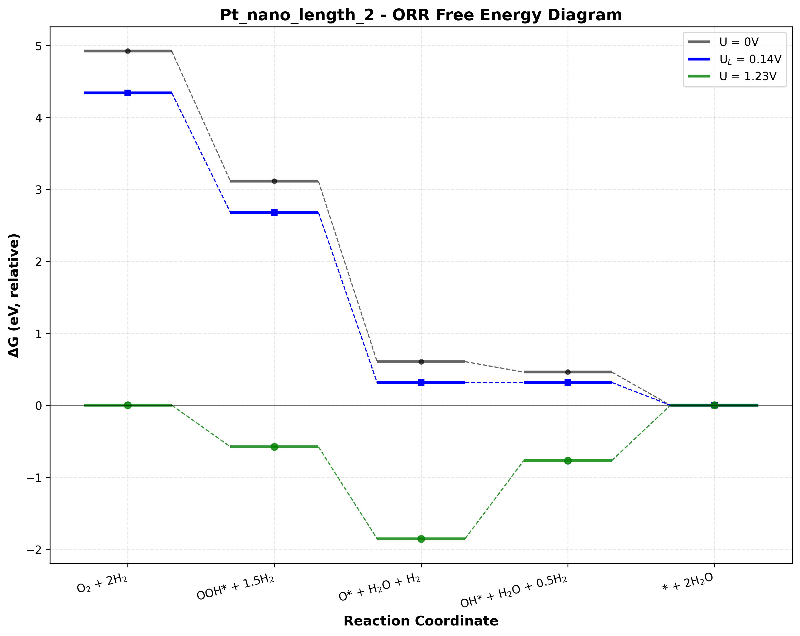 |
| 3 | 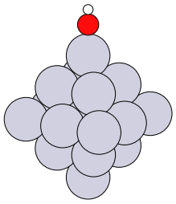 | 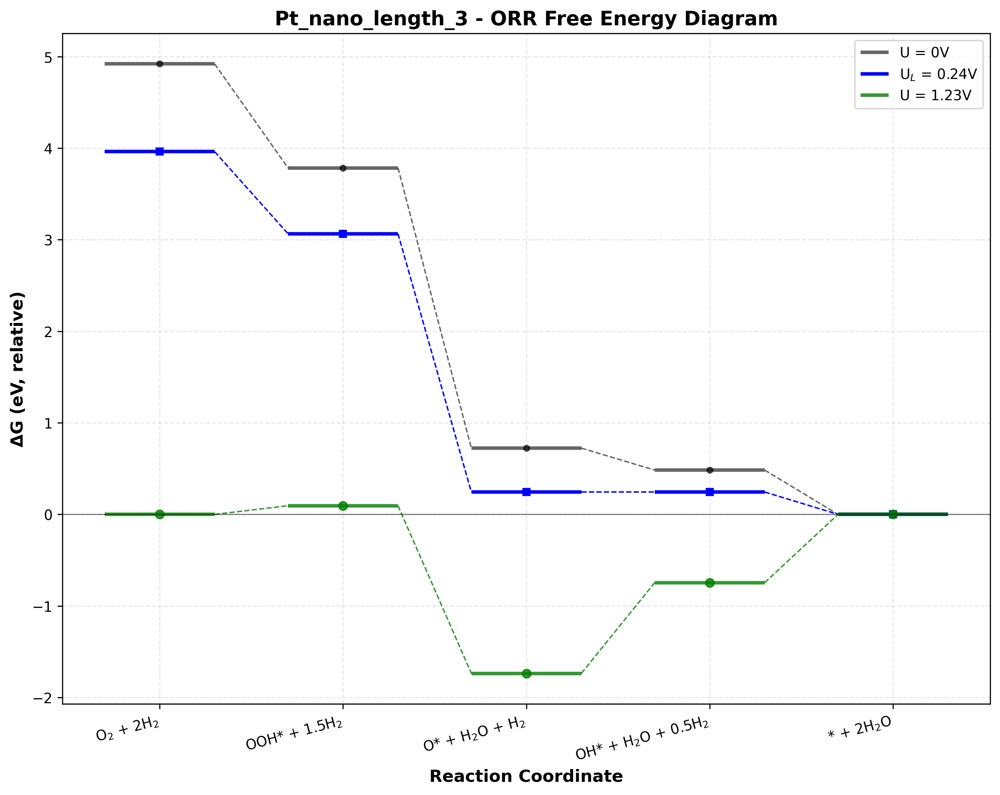 |
| 4 |  | 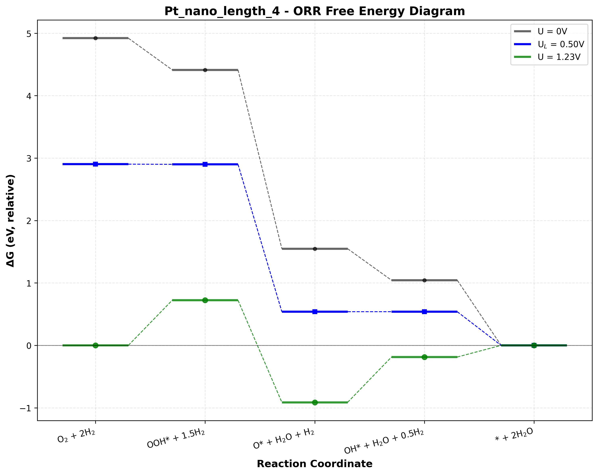 |
| 5 | 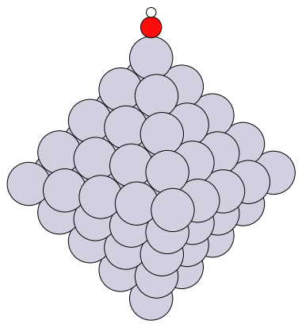 | 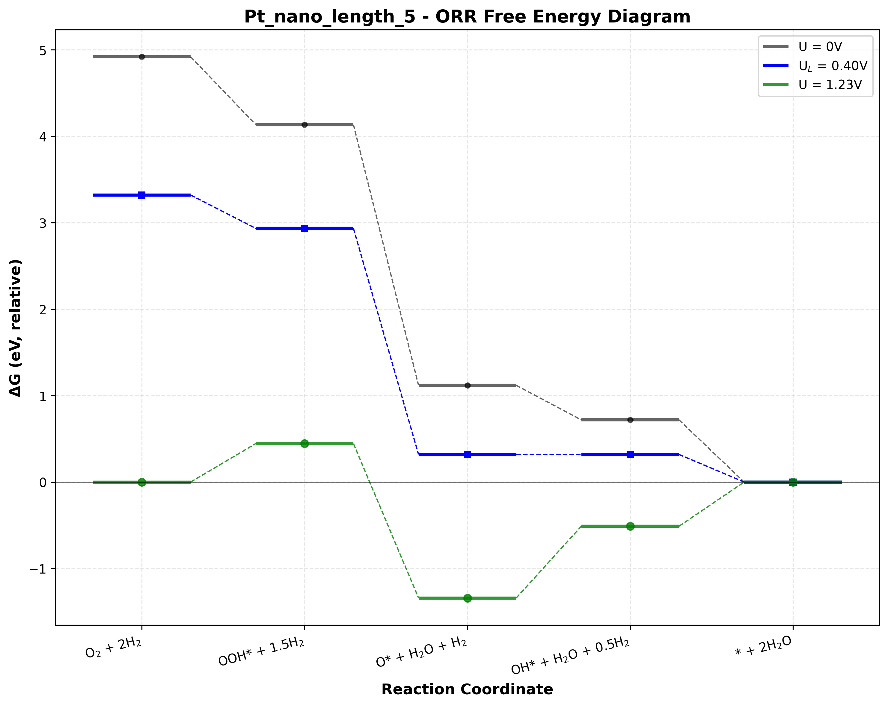 |


From the generated graph, you can extract the following information:

- Overpotential (η) values and trends for each size nanoparticle
- Rate Determining Step (RDS) for each size
- Comparison of free energy changes at U=0V and U=1.23V
- Activity differences by size (lower overpotential indicates higher activity)
