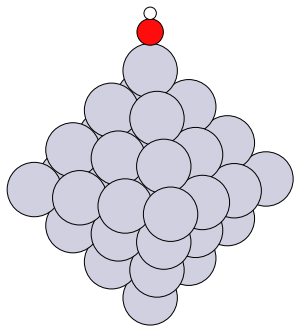
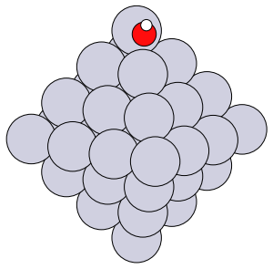
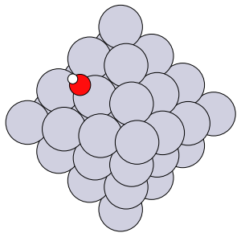
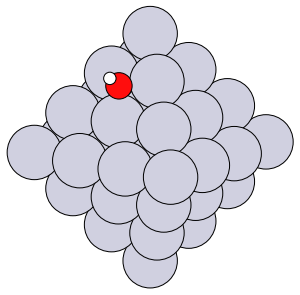
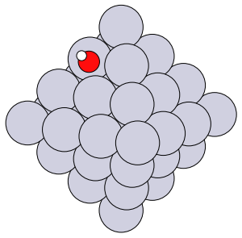
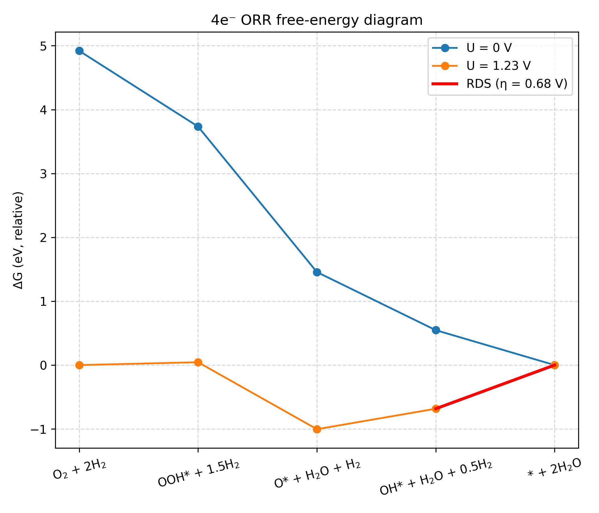

# ナノ粒子触媒のORR過電圧計算

このディレクトリには、ナノ粒子触媒における酸素還元反応（ORR）の過電圧を計算するサンプルコードが含まれています。

## 概要

酸素還元反応（ORR）は、4段階の電子移動プロセスから構成されます：

1. `O₂(g) + * + ½H₂ → OOH*`
2. `OOH* + ½H₂ → O* + H₂O`
3. `O* + ½H₂ → OH*`
4. `OH* + ½H₂ → * + H₂O`

このワークフローでは、Ptナノ粒子上でのORR過電圧を計算し、触媒活性を評価します。


## 1. 吸着構造の可視化

まず、ナノ粒子上の吸着サイトを理解するために、吸着構造を可視化します。


```python
import numpy as np
from ase import Atoms
from ase.io import write
from ase.cluster.octahedron import Octahedron
from orr_overpotential_calculator import place_adsorbate
import os

# Ptでエッジ長4原子の正八面体クラスターを作成
cluster = Octahedron('Pt', length=4)  
print(f"クラスター中の原子数: {len(cluster)}")

# 吸着分子OHを定義（O原子が原点、H原子がz方向0.97Åに位置）
adsorbate = Atoms("OH", positions=[(0, 0, 0), (0, 0, 0.97)])

# 保存先ディレクトリ
output_dir = "result"
os.makedirs(output_dir, exist_ok=True)

# 配置するサイト原子のインデックスリスト
site_indices = [
    (0,),           # edge_top
    (0, 1),         # edge_bridge
    (12,),          # face_top
    (1, 12),        # face_bridge
    (1, 2, 12)      # face_3fold_hollow
]

# 各site_indexについて構造を作成し画像を保存
for site_index in site_indices:
    # OH分子を配置（高さ2.0Åで配置）
    combined_structure = place_adsorbate(cluster, adsorbate, site_index, height=2.0)
    print(f"Site index {site_index}: 配置後の全原子数: {len(combined_structure)}")
    
    # ファイル名を作成
    site_str = "_".join(map(str, site_index))
    filename = f"cluster_adsorbate_index_{site_str}.png"
    filepath = os.path.join(output_dir, filename)
    
    # 画像を保存
    write(filepath, combined_structure, rotation='-90z, 100y, 15x')
    print(f"保存完了: {filepath}")
```

### 生成される吸着構造

実行後、`result/`ディレクトリに以下の画像が生成されます：

各サイトタイプの吸着構造が以下のように生成されます：

| サイトタイプ | ファイル名 | 構造 |
|-------------|-----------|------|
| エッジトップサイト | `cluster_adsorbate_index_0.png` |  |
| エッジブリッジサイト | `cluster_adsorbate_index_0_1.png` |  |
| 面トップサイト | `cluster_adsorbate_index_12.png` |  |
| 面ブリッジサイト | `cluster_adsorbate_index_1_12.png` |  |
| 面3配位ホローサイト | `cluster_adsorbate_index_1_2_12.png` |  |


## 2. ORR過電圧計算

### run_nanoparticle_orr.py

```python
#!/usr/bin/env python3
import argparse
import sys
from pathlib import Path
from typing import Dict, Any, List, Tuple

# ASEのインポート
from ase.build import fcc111
from ase.cluster.octahedron import Octahedron

# ORR過電圧計算関数をインポート
from orr_overpotential_calculator import calc_nanoparticle_orr_overpotential

#---------------------
# 引数の設定
#---------------------
base_dir = str(Path(__file__).parent / "Pt_nanoparticle_mattersim")
force = True                    # 既存計算の上書き
log_level = "INFO"             # ログレベル
calc_type = "mattersim"        # 計算エンジン
yaml_path = str(Path(__file__).parent / "vasp.yaml")  # 設定ファイル

# Ptナノ粒子クラスターの作成（正八面体、エッジ長4原子）
cluster = Octahedron('Pt', length=4, cutoff=0) 

# 吸着サイトの定義（各吸着種に対して計算するサイトのインデックス）
orr_adsorbates: Dict[str, List[Tuple]] = {
    "HO2": [(0,), (0, 1), (12,), (1, 12), (1, 2, 12)],  # OOH吸着種
    "O":   [(0,), (0, 1), (12,), (1, 12), (1, 2, 12)],  # O吸着種
    "OH":  [(0,), (0, 1), (12,), (1, 12), (1, 2, 12)],  # OH吸着種
}

# 関数呼び出し：辞書として結果を受け取る
result = calc_nanoparticle_orr_overpotential(
    nanoparticle=cluster,
    base_dir=base_dir,
    force=force,
    log_level=log_level,
    calc_type=calc_type,
    adsorbates=orr_adsorbates,
    yaml_path=yaml_path
)

# 必要な値を辞書から取得
eta = result["eta"]
diffG_U0 = result["diffG_U0"]
diffG_eq = result["diffG_eq"]

print(f"ORR overpotential: {eta:.3f} V")
print(f"Reaction Free Energy Change at U=0V: {diffG_U0}")
print(f"Reaction Free Energy Change at U=1.23V: {diffG_eq}")
```

### 生成される自由エネルギーダイアグラムの例

計算完了後、以下の様な自由エネルギーダイアグラムが生成されます：




## 3. 計算の流れ

### 3.1 ナノ粒子の最適化
- 正八面体Ptクラスター（55原子）の構造最適化
- 真空層サイズはクラスターサイズに応じて自動調整

### 3.2 気相分子の最適化
以下の分子の気相構造を最適化：
- H₂, O₂, H₂O（気相のみ）
- OH, OOH, O（気相 + 吸着計算）

### 3.3 吸着計算
各吸着種（OH, OOH, O）について、指定した5つのサイトで吸着計算：
- `(0,)`: エッジのトップサイト
- `(0, 1)`: エッジのブリッジサイト  
- `(12,)`: 面のトップサイト
- `(1, 12)`: 面のブリッジサイト
- `(1, 2, 12)`: 面の3配位ホローサイト

### 3.4 反応エネルギー計算
- 各吸着種の最安定サイトを選択
- 4段階の反応エネルギー（ΔE₁, ΔE₂, ΔE₃, ΔE₄）を計算
- エネルギー補正を適用：
  - O₂エネルギー補正（DFT誤差補償）
  - 溶媒効果補正（OOH*: -0.1 eV, OH*: -0.2 eV）

### 3.5 過電圧計算
- 零点振動エネルギー（ZPE）補正
- エントロピー（T×S）補正  
- 自由エネルギー変化（ΔG）の計算
- 限界電位（U_L）と過電圧（η = 1.23 - U_L）の算出

## 4. 出力結果

### 4.1 ディレクトリ構造
```
Pt_nanoparticle_mattersim/
├── nanoparticle/           # ナノ粒子最適化結果
├── H2/                     # H₂気相計算
├── O2/                     # O₂気相計算
├── H2O/                    # H₂O気相計算
├── OH/                     # OH計算
│   ├── OH_gas/            # 気相最適化
│   └── adsorption/        # 吸着計算（各サイト）
├── HO2/                    # OOH計算
└── O/                      # O計算
```

### 4.2 主要な出力ファイル
- `all_results.json`: 全計算結果の統合データ
- `ORR_summary.txt`: 過電圧計算の要約
- `ORR_free_energy_diagram.png`: 自由エネルギー図

### 4.3 結果の解釈
- **過電圧（η）**: 小さいほど高活性（理想的には0 V）
- **律速段階**: 自由エネルギー図で最も高いエネルギー障壁を持つ段階
- **限界電位（U_L）**: 全反応段階が熱力学的に下り坂になる電位

## 5. パラメータの調整

### 5.1 吸着サイトの変更
`orr_adsorbates`辞書でサイトインデックスを変更可能：

```python
orr_adsorbates = {
    "HO2": [(0,), (5,), (10,)],  # 特定のサイトのみ
    "O":   [(0,), (1,), (2,)],
    "OH":  [(0,), (1,), (2,)],
}
```

### 5.2 クラスターサイズの変更
```python
cluster = Octahedron('Pt', length=3)  # より小さなクラスター
cluster = Octahedron('Pt', length=5)  # より大きなクラスター
```


## 6. 注意点
- place_adsorbate関数は吸着分子を指定したサイトに配置します。そのため、作成した構造に合わせて、適宜サイトの選択は事前に確認してください。
