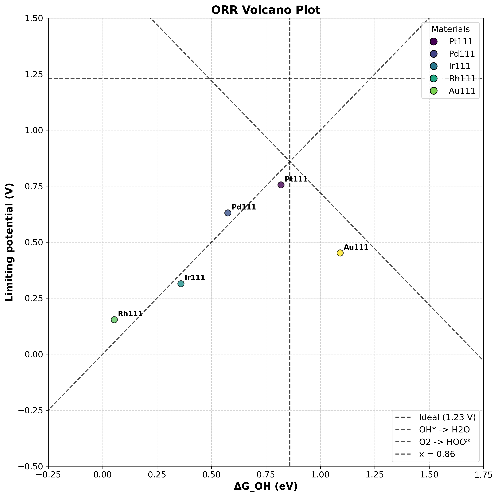

# ORR Overpotential Calculation and Volcano Plot Generation Guide

This directory demonstrates how to calculate Oxygen Reduction Reaction (ORR) overpotentials and create volcano plots.

## Overview

The Oxygen Reduction Reaction (ORR) is a crucial reaction in fuel cells. We consider the following 4-step reaction pathway on catalyst surfaces:

1. `O₂(g) + * + ½H₂ → OOH*`
2. `OOH* + ½H₂ → O* + H₂O`
3. `O* + ½H₂ → OH*`
4. `OH* + ½H₂ → * + H₂O`

The overpotential η is determined by the most unfavorable reaction step.

## Calculation Procedure

### 1. Single Material ORR Overpotential Calculation

````python

#!/usr/bin/env python3
from pathlib import Path
from ase.build import fcc111
from orr_overpotential_calculator import calc_orr_overpotential

# Parameter settings
base_dir = str(Path(__file__).parent / "Pt111")
force = True  # Overwrite existing calculations
calc_type = "vasp"  # or "mattersim"
yaml_path = str(Path(__file__).parent / "vasp.yaml")

# Create bulk structure (Pt fcc(111) surface calculation)
bulk = fcc111("Pt", size=(3, 3, 4), a=3.9, vacuum=None, periodic=True)

# Define adsorption sites
orr_adsorbates = {
    "HO2": [(0.0, 0.0), (0.5, 0.0), (0.33, 0.33), (0.66, 0.66)], # ontop, bridge, fcc, hcp
    "O":   [(0.0, 0.0), (0.5, 0.0), (0.33, 0.33), (0.66, 0.66)],
    "OH":  [(0.0, 0.0), (0.5, 0.0), (0.33, 0.33), (0.66, 0.66)],
}

# Execute ORR overpotential calculation
result = calc_orr_overpotential(
    bulk=bulk,
    base_dir=base_dir,
    force=force,
    log_level="INFO",
    calc_type=calc_type,
    adsorbates=orr_adsorbates,
    yaml_path=yaml_path
)

# Display results
eta = result["eta"]
diffG_U0 = result["diffG_U0"]
diffG_eq = result["diffG_eq"]

print(f"ORR overpotential: {eta:.3f} V")
print(f"Reaction Free Energy Change at U=0V: {diffG_U0}")
print(f"Reaction Free Energy Change at U=1.23V: {diffG_eq}")

````

### 2. Multiple Materials Integration and Volcano Plot Creation

````python

from orr_overpotential_calculator import generate_result_csv, create_orr_volcano_plot
from pathlib import Path

script_dir = Path(__file__).parent

# Material and JSON file path mapping
materials = {
    "Pt111": script_dir / "Pt111" / "all_results.json",
    "Pd111": script_dir / "Pd111" / "all_results.json", 
    "Ir111": script_dir / "Ir111" / "all_results.json",
    "Rh111": script_dir / "Rh111" / "all_results.json",
    "Au111": script_dir / "Au111" / "all_results.json",
}

# Output file paths
output_csv_path = script_dir / "orr_result.csv"
output_png_path = script_dir / "orr_volcano_plot.png"

# 1. Generate CSV file
generate_result_csv(materials, str(output_csv_path), verbose=True)
print(f"CSV file created: {output_csv_path}")

# 2. Create Volcano Plot
create_orr_volcano_plot(output_csv_path, output_png_path)
print(f"Volcano Plot created: {output_png_path}")

````

## Calculation Workflow

### Phase 1: Structure Optimization
1. **Bulk Optimization**: Determination of crystal lattice parameters
2. **Slab Optimization**: Surface structure relaxation
3. **Gas Molecule Optimization**: Structure optimization of H₂, H₂O, O₂

### Phase 2: Adsorption Calculations
For each molecule (OH*, O*, OOH*):
- Structure optimization at multiple adsorption sites (ontop, bridge, hollow)
- Determination of most stable adsorption energy

### Phase 3: Thermodynamic Analysis
1. **Reaction Energy Calculation**: Calculate ΔE for 4-step reactions
2. **Free Energy Corrections**: 
   - Zero-point energy (ZPE) correction
   - Entropy (TΔS) correction
   - Solvent correction (OOH*: -0.1 eV, OH*: -0.2 eV)
3. **Overpotential Determination**: η = 1.23 - U_L (U_L: limiting potential)

## Important Output Files

| File | Description |
|------|-------------|
| `all_results.json` | Integrated data from all calculations |
| `orr_result.csv` | Comparative data for multiple materials |
| `ORR_free_energy_diagram.png` | Free energy diagram |
| `orr_volcano_plot.png` | Volcano plot |

## Generated Volcano Plot Example



## Adsorption Site Definitions

Adsorption sites are specified using fractional coordinates:

| Coordinate | Site Type | Description |
|------------|-----------|-------------|
| `(0.0, 0.0)` | Ontop | Directly above a surface atom |
| `(0.5, 0.0)` | Bridge | Between two surface atoms |
| `(0.33, 0.33)` | FCC hollow | Three-fold hollow site (FCC stacking) |
| `(0.66, 0.66)` | HCP hollow | Three-fold hollow site (HCP stacking) |

## Calculation Parameters

### Default Settings
- **Vacuum thickness**: 30.0 Å (for slab calculations)
- **Gas box size**: 15.0 Å (for gas molecule calculations)
- **Initial adsorbate height**: 2.0 Å above surface

### Thermodynamic Corrections
- **Temperature**: 298.15 K
- **ZPE corrections**: Applied according to literature values
- **Entropy corrections**: Temperature-dependent entropy terms
- **Solvent corrections**: OOH* (-0.1 eV), OH* (-0.2 eV)

## Important Notes

### Calculation Settings
- The examples use dispersion correction calculations
- Corresponding solvent effects are configured for dispersion corrections
- Additional details to be added

### Scheduled to be added
- ABC...

## References

1. Nørskov, J. K. et al. (2004). Origin of the Overpotential for Oxygen Reduction at a Fuel-Cell Cathode. *J. Phys. Chem. B*, 108, 17886-17892.
2. Zhang, Q. & Asthagiri, A. (2019). Solvation effects on DFT predictions of ORR activity on metal surfaces. *Catal. Today*, 323, 35-43.


